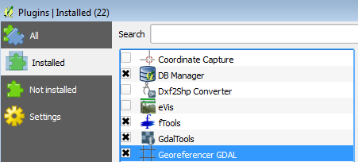
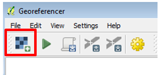
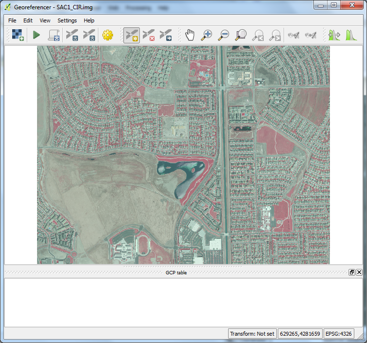

# GST 105: Introduction to Remote Sensing
## Lab 4: Image Rectification
### Objective – Perform an Image Rectification

Document Version: 8/27/2014

**FOSS4G Lab Author:**
Richard Smith, Ph.D.  
Texas A&M University - Corpus Christi

**Original Lab Content Author:**
Nathan Jennings

---

Copyright © National Information Security, Geospatial Technologies Consortium (NISGTC)

The development of this document is funded by the Department of Labor (DOL) Trade Adjustment Assistance Community College and Career Training (TAACCCT) Grant No.  TC-22525-11-60-A-48; The National Information Security, Geospatial Technologies Consortium (NISGTC) is an entity of Collin College of Texas, Bellevue College of Washington, Bunker Hill Community College of Massachusetts, Del Mar College of Texas, Moraine Valley Community College of Illinois, Rio Salado College of Arizona, and Salt Lake Community College of Utah.  This work is licensed under the Creative Commons Attribution 3.0 Unported License.  To view a copy of this license, visit http://creativecommons.org/licenses/by/3.0/ or send a letter to Creative Commons, 444 Castro Street, Suite 900, Mountain View, California, 94041, USA.  

This document was original modified from its original form by Richard Smith and continues to be modified and improved by generous public contributions.

---

### 1. Introduction

Although many photogrammetric processes described in the lecture require specialized photogrammetric software, this lab reviews how to perform an image rectification, which is one of the fundamental methods used in photogrammetry.  In a real-world setting additional training and education would be required in addition to an investment in photogrammetric software.  Many ortho imaging and analysis firms make the necessary investments to perform photogrammetric processes.

This lab includes the following tasks:

+ Task 1 – Set Up Referencing Environment
+ Task 2 – Select Common Control Points
+ Task 3 – Rectify the Image
+ Task 4 – Post-Rectification Steps

### 2. Objective: Perform an Image Rectification

Students will walk through the processes of conducting an image rectification using 2009 6” ortho rectified aerial photography to “rectify” a 2005 1m Color IR USGS image.

### 3. How Best to Use Video Walk Through with this Lab

To aid in your completion of this lab, each lab task has an associated video that demonstrates how to complete the task.  The intent of these videos is to help you move forward if you become stuck on a step in a task, or you wish to visually see every step required to complete the tasks.

We recommend that you do not watch the videos before you attempt the tasks.  The reasoning for this is that while you are learning the software and searching for buttons, menus, etc…, you will better remember where these items are and, perhaps, discover other features along the way.  With that being said, please use the videos in the way that will best facilitate your learning and successful completion of this lab.

### Task 1 – Set Up Referencing Environment

In this task, we will set up our referencing environment to prepare for image rectification.
To perform the image rectification, you will be using a QGIS Plugin and a reference image. Plugins are small add-ons to QGIS. Some are created by the core QGIS development team and others are created by third party developers.  The reference image will be used to pick control points and match them with the image we will be georeferencing.

**Note for Mac users:** *You will need to download and install the MrSID plugin from <http://j-vh.me/XfKiEd> (located about halfway down the page) to open .sid files (and, therefore, complete this lab).  Make sure you read the post-install read-me text file as you will need to create a free account at LizardTech, download an SDK, unzip and copy the files to the System Library GDAL folder.*

1.	Open QGIS Desktop 2.4.0.
2.	Click ‘Add Raster Layer’ button  and add ‘SAC_13.sid’ to the map canvas.

SAC_13.sid is a MrSID compressed image.  It is an ortho image from the City of Sacramento from 2009.  The pixel size is six inches and the coordinate system is NAD 1983 California State Plane II FIPS 0402 Feet, EPSG: 102642. This image will serve as the reference layer for our rectification.

Now we will enable the Georeferencer Plugin and toolbar.

3.	From the menu bar, choose Plugins  Manage and Install Plugins
4.	The Plugins manager will open. Options along the left side allow you to switch between Installed, Not Installed, and Settings. The plugin you’ll use is a Core QGIS Plugin called Georeferencer GDAL. 
5.	Since it is a Core plugin it will already be installed. You just need to enable it. Click on Installed plugins and check the box next to Georeferencer GDAL (see figure below). Click Close.

6.	To open the Georeferencer plugin go to the menu bar choose Raster-->Georeferencer-->Georeferencer (see figure below).

7.	The Georeferencer window opens. Click the Open Raster button at the upper left hand side (see figure below).

8. Navigate to the lab folder and select the SAC1_CIR.img and click Open. *Note: If the Coordinate Reference System Selector window opens click Cancel to close. This dataset does not yet have an Earth-based coordinate system.*

SAC1_CIR.img is an image of Sacramento covering a smaller area than our reference image we loaded in Step 3 above.  It is in the ERDAS Imagine format with an undefined coordinate system as it is needing to be referenced.

You should now have the image to be rectified loaded as shown in the figure below.

9.	Arrange the Georeferencer window to the left of your screen (or, preferably a second monitor if you have one) so that you can see both the source image and the image to be rectified.  This will allow for easier identification of common points between images.  See Figure below for reference.

The referencing environment setup is now complete and we can move on to referencing the image.

### Task 2 - Select Common Control Points

### Task 3 – Rectify the Image

### Task 4 – Post-Rectification Steps

### 4. Conclusion

You have completed the fundamental image rectification process that is common throughout many photogrammetric processes.  Although image rectification is much more involved than this lab, the same principles of identifying and collecting high quality ground control that are then used to rectify image data is important.  In addition being able to review and determine how well the image rectification process and how to take subsequent steps to improve the output is equally important.

### 5. Discussion Questions

1.	Describe how the rectified image compares to the 2009 reference imagery.  How effective was the rectification?  How might you improve the rectification?
2.	What challenges did you face when choosing common control points between the two images?  What strategies did you employee to mitigate those challenges?
3.	Why did the white border show up on the rectified image when added to the QGIS map canvas?

